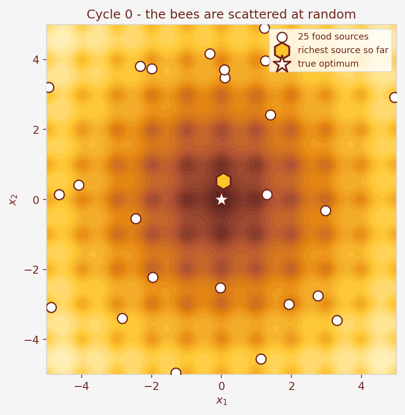

# Everything in This Project, Explained From Scratch

**Written for:** someone who has never heard of the Artificial Bee Colony algorithm and does not
remember what the Ackley function is. No background assumed. Read it top to bottom.

This document explains, in order:

1. [What problem we were given](#1-what-problem-we-were-given)
2. [The Artificial Bee Colony, from zero](#2-the-artificial-bee-colony-from-zero)
3. [The Ackley function, from zero](#3-the-ackley-function-from-zero)
4. [Putting them together: the full recipe](#4-putting-them-together-the-full-recipe)
5. [The settings we chose, and why](#5-the-settings-we-chose-and-why)
6. [Every figure, explained one by one](#6-every-figure-explained-one-by-one)
7. [What we found](#7-what-we-found)
8. [Bees versus genes](#8-bees-versus-genes)
9. [How we checked our own work](#9-how-we-checked-our-own-work)
10. [What is in the folder, and how to re-run it](#10-what-is-in-the-folder-and-how-to-re-run-it)

---

## 1. What problem we were given

The assignment is one sentence long:

> **Find the lowest point of the 2-D Ackley function using the Artificial Bee Colony algorithm.**

Let's unpack what each piece of that means, because every word matters.

**"The 2-D Ackley function"** is a mathematical formula that takes two numbers in and gives one
number out. Call the two inputs `x₁` and `x₂`. Call the output `f`. So `f(x₁, x₂)` is a single
number.

**"Find the lowest point"** means: *choose* `x₁` and `x₂` so that `f` comes out as small as
possible.

**"2-D"** means there are exactly two inputs. (The formula also works with 3, 10 or 100 inputs —
we use 2.)

There are two rules:

* Both `x₁` and `x₂` must stay between **−5 and +5**.
* The program is **never told** where the answer is.

That second rule is the whole point. We happen to know the correct answer is `x₁ = 0, x₂ = 0`,
where `f = 0`. But the algorithm never sees that. It is only allowed to *pick a point and ask
what `f` is there*. We use the known answer at the very end, to measure how close we got.

> **An analogy.** Imagine a huge dark field with dips and hollows. You want to find the single
> deepest hollow. You have a torch that only lights up the exact spot you are standing on, and a
> depth gauge. You can walk anywhere in the field, measure the depth where you stand, and that's
> it. How do you find the deepest point?
>
> That is exactly our situation. "Measuring the depth" = evaluating `f` at a point.

This is the **same assignment** that was already solved in the parent folder with a **Genetic
Algorithm**. Same function, same range, same budget. Only the search method changes. That makes
the two directly comparable, which we take advantage of in [section 8](#8-bees-versus-genes).

---

## 2. The Artificial Bee Colony, from zero

### 2.1 The idea

Real honey bees find flowers without a map, without a leader, and without anyone planning the
route. A hive of thousands of bees reliably locates the richest flower patches for kilometres
around. They do it with a very simple set of behaviours.

In 2005, a researcher named **Dervis Karaboga** noticed that those behaviours are a good
general-purpose search method, and wrote them down as an algorithm. He called it the
**Artificial Bee Colony**, or **ABC**.

### 2.2 The one translation you need

Everything in ABC rests on a single translation:

| In the hive | In our program |
|---|---|
| a **flower patch** (a "food source") | one candidate answer — a pair of numbers `[x₁, x₂]` |
| how much **nectar** the patch holds | how good that answer is |
| a bee **visiting** a patch | the program evaluating `f` at that point |

So "the bees are searching for the richest flower patch" and "the program is searching for the
pair of numbers that makes `f` smallest" are the *same sentence*, said two different ways.

One wrinkle: more nectar means *better*, but smaller `f` means *better*. So they point in
opposite directions. We fix that in [section 4.4](#44-step-3b-the-onlooker-bee-phase) with one
short formula.

### 2.3 The three kinds of bee

A real hive splits its workforce into three roles. ABC copies all three.


**1. Employed bees — "stay and improve what you have."**

Each employed bee owns exactly one flower patch. It keeps checking spots *right next to* its own
patch. If a neighbouring spot is better, it moves there and forgets the old one. If not, it stays
put.

This is called **exploitation** — not in a bad sense, it just means "squeeze more out of
something you already found." It is careful, local, patient improvement.

> In our program: 25 employed bees, each owning one of our 25 candidate answers. Each one tries
> one nearby point per round.

**2. Onlooker bees — "go help whoever is doing best."**

Onlooker bees own nothing. They wait inside the hive and watch the other bees come home. Then
they choose a patch to go and help with. Crucially, they are **more likely to choose a patch that
looked rich** — but not guaranteed to. A poor patch still has a small chance.

This is **guided search**: extra effort, aimed at the promising places.

> In our program: 25 onlookers. Each one picks a candidate answer with a probability based on how
> good it is, then does exactly the same "try a nearby point" search an employed bee does.

**3. Scout bees — "give up and start fresh."**

If a patch has been worked and worked and simply will not get any better, the hive eventually
abandons it. The bee that owned it becomes a scout and flies off to a completely random new
location.

This is **exploration**: a deliberate jump somewhere unknown, accepting that it might be worse,
in exchange for the chance of finding something entirely new.

> In our program: we count how many times in a row each answer has failed to improve. If a
> counter passes a threshold we call **`limit`**, that answer is deleted and replaced with a
> fresh random one.

### 2.4 The waggle dance

How does an onlooker know which patch is rich? Real bees perform a **waggle dance** on the hive
wall. The direction of the dance encodes the bearing to the patch, its duration encodes the
distance, and its vigour encodes the quality.

In the algorithm we don't need direction or distance — we just need *quality*, so that onlookers
can choose proportionally. We implement that with a **roulette wheel**:

> Imagine a circular wheel divided into 25 slices, one per candidate answer. **The better the
> answer, the bigger its slice.** Spin the wheel; whatever slice the pointer lands on, that's the
> answer this onlooker will go and help with. Spin it 25 times, once per onlooker.

Good answers get big slices, so they get visited often. Bad answers get thin slices, so they are
visited rarely — but *not never*, which is what stops the colony from committing to a bad area
too early.

### 2.5 Why this combination works

Any search method has to balance two opposing urges:

* **Exploitation** — keep polishing the best thing you have found. Too much of this and you
  perfect a mediocre answer while never discovering the great one somewhere else.
* **Exploration** — go look somewhere new. Too much of this and you wander forever, never
  refining anything.

ABC's neat trick is that it assigns these urges to **different bees**. Employed bees exploit.
Scouts explore. Onlookers sit in between, pushing extra effort towards whatever currently looks
best. Nobody has to decide the balance — it falls out of the division of labour.

---

## 3. The Ackley function, from zero

### 3.1 It is a landscape

Forget the formula for a moment. Here is what the Ackley function *looks like*:


**Left panel:** a 3-D surface. The two horizontal directions are `x₁` and `x₂`. The height is `f`.
Think of it as a real landscape you could walk on, except we are looking for the *lowest* point,
not the highest.

**Right panel:** the same thing seen from directly above, like a contour map. Dark = low,
pale = high. The white star marks the true lowest point at `(0, 0)`.

Two things stand out:

1. There is **one big funnel** sloping down towards the centre. Good — that gives the search a
   general direction to follow.
2. The whole surface is **covered in small ripples**. Those ripples are the problem.

### 3.2 Why the ripples make it hard

Here is a single straight-line slice through the surface (we fix `x₂ = 0` and walk along `x₁`):


Look at all those dips. Each one is a **local minimum**: a point that is lower than everything
immediately around it, but *not* the lowest point overall.

> **Why that matters.** The obvious way to find a low point is "always step downhill." But if you
> start on the side of one of these dips, downhill leads you straight into the bottom of *that
> dip*. Once you are there, **every** direction is uphill, so you stop — and you stop in the
> wrong place.

The orange dots in the figure mark some of these traps. There are dozens of them in our square,
and a simple downhill method can be caught by any of them.

**Could we just check every point instead?** No. To get an answer accurate to six decimal places
you'd need a grid with spacing `10⁻⁶` across a 10×10 square — about **10¹⁴ points**. At a million
evaluations per second that is over three years. We are going to use about **5,000**.

So we need a method that looks in several places at once, shares information between them, and
can escape a dip. That is exactly what a bee colony does.

### 3.3 The formula, piece by piece

The general formula, for any number of inputs `n`:

```
f(x) = −a·exp( −b·√( (1/n)·Σxᵢ² ) ) − exp( (1/n)·Σcos(c·xᵢ) ) + a + e
```

with the standard constants `a = 20`, `b = 0.2`, `c = 2π`. Setting `n = 2` and expanding the two
sums gives the version we actually use:

```
f(x₁,x₂) = −20·exp( −0.2·√( (x₁² + x₂²) / 2 ) )
           − exp( ( cos(2πx₁) + cos(2πx₂) ) / 2 )
           + 20 + e
```

Don't be put off — it is just **three pieces added together**, and each does one job.

**Piece 1: `−20·exp(−0.2·√((x₁²+x₂²)/2))` — the funnel.**

`√((x₁²+x₂²)/2)` is basically "how far you are from the centre." The further out you go, the
closer this whole piece gets to 0; the closer to the centre, the closer it gets to −20. **This is
the smooth bowl shape.** On its own it would be an easy problem.

**Piece 2: `−exp((cos(2πx₁) + cos(2πx₂))/2)` — the ripples.**

`cos` is a wave that repeats. `cos(2πx)` completes one full wave every time `x` increases by 1.
So this piece ripples up and down with period 1 in both directions. **This is what creates all
the local minima**, one roughly at every pair of whole numbers.

**Piece 3: `+ 20 + e` — the shift.**

This does nothing to the shape. It just slides the whole landscape up so that the lowest point
comes out at exactly 0 instead of some awkward negative number. It makes the answer easy to
check.

### 3.4 Checking the answer by hand

Put `x₁ = 0` and `x₂ = 0` into each piece:

| Piece | At the origin | Value |
|---|---|---|
| 1 — funnel | `−20·exp(−0.2·√0)` = `−20·exp(0)` = `−20·1` | **−20** |
| 2 — ripples | `−exp((cos 0 + cos 0)/2)` = `−exp((1+1)/2)` = `−exp(1)` | **−e ≈ −2.71828** |
| 3 — shift | | **+20 + e ≈ +22.71828** |

Add them: `−20 − e + 20 + e = 0`. Exactly zero. The pieces cancel perfectly, which is why the
`+20 + e` was put there in the first place.

Here is the same arithmetic at three different points, computed by the code:

```
origin       (+0,+0): term1=-20.00000  term2=-2.71828  +20+e=22.71828  ->  f =  0.00000
a local dip  (+1,+0): term1=-17.36247  term2=-2.71828  +20+e=22.71828  ->  f =  2.63753
far corner   (+4,-4): term1= -8.98658  term2=-2.71828  +20+e=22.71828  ->  f = 11.01342
```

Notice the middle row. At `(1, 0)` the *ripple* term is `−2.71828` — exactly the same as at the
origin, because `cos(2π·1) = cos(0) = 1`. That is what a local minimum is: the ripple part is as
good as it gets, but the funnel part is still worse than at the centre. A downhill search sitting
there sees nothing but uphill in every direction.

> **One honest footnote.** On a computer, `f(0,0)` does not come out as *exactly* 0 — it comes
> out as `4.441 × 10⁻¹⁶`, because `−20 − e + 20 + e` loses a few bits to rounding. That tiny
> number is the floor; no answer can score meaningfully below it. Our final answer is
> `6.5 × 10⁻¹³`, which is about **1,200× larger** than that floor. So our result is a genuine
> measurement, not rounding noise. Worth knowing if anyone asks.

---

## 4. Putting them together: the full recipe

Now we combine sections 2 and 3. Here is the complete algorithm, as given on slide 18 of the
course notes:

```
Step 1   Assign the control parameters
Step 2   Create 25 random food sources and evaluate them all
Step 3   Repeat until you stop:
            a. employed bee phase    – 25 nearby tries
            b. onlooker bee phase    – 25 more tries, chosen by roulette wheel
            c. memorise the best solution found so far
            d. scout bee phase       – restart any source that is stuck
Step 4   Stop and report the memorised best
```

Let's walk through each step with real numbers.

### 4.1 Step 2: creating the first food sources

Every coordinate is picked at random inside the allowed range:

```
x_ij = x_min + rand(0,1) × (x_max − x_min)
```

`rand(0,1)` is a random number between 0 and 1. With `x_min = −5` and `x_max = +5` this is just
`−5 + rand × 10`. If `rand` gives 0 you land on −5; if it gives 1 you land on +5; anything in
between lands in between.

Here are five sources actually produced by the code, with their `f` values:

```
source 0: [ +2.7396,  -0.6112]   f =  8.6111
source 1: [ +3.5860,  +1.9737]   f = 10.4412
source 2: [ -4.0582,  +4.7562]   f = 12.8309
source 3: [ +2.6114,  +2.8606]   f = 10.2138
source 4: [ -3.7189,  -0.4961]   f = 10.4027
```

All of them are poor — `f` around 8 to 13, when the answer is 0. That is expected: these are
random guesses. Here is what all 25 look like on the landscape:



Scattered everywhere, no pattern. The colony knows nothing yet.

Each source also gets a **trial counter**, starting at 0. We'll need it in step 3d.

> **Nice detail:** the scout phase in step 3d uses *this exact same formula* to create its
> replacement source. So we only had to write this line once.

### 4.2 Step 3a — the employed bee phase

This is the heart of the whole algorithm, so we'll go slowly.

Each employed bee wants to try a point *near* its own source. The formula is:

```
v_ij = x_ij + φ_ij × (x_ij − x_kj)
```

In plain English, a bee sitting on source `i` does this:

1. **Pick another source at random.** Call it `k`. It must not be itself.
2. **Pick one of the two coordinates at random.** Call it `j`. The *other* coordinate is copied
   across unchanged.
3. **Work out the gap** between my coordinate and the partner's: `x_ij − x_kj`.
4. **Pick a random number `φ` between −1 and +1.**
5. **Move by `φ` times the gap.** A positive `φ` moves *away* from the partner; a negative `φ`
   moves *towards* it. `φ` near 0 barely moves at all.
6. If the result fell outside `[−5, +5]`, pull it back to the edge.

Here is that worked out by hand. Our bee is at `x_i = [2.0, −1.0]`, its random partner is at
`x_k = [−3.0, 0.5]`, so the gaps are `(+5.0, −1.5)`:

| `φ` | coordinate `j` | new point `v` | `f(x_i)` | `f(v)` | outcome |
|---|---|---|---|---|---|
| +0.6 | 1st | `[+5.0000, −1.0000]` | 5.4221 | 10.2758 | reject |
| −0.6 | 1st | `[−1.0000, −1.0000]` | 5.4221 | **3.6254** | **accept** |
| +0.3 | 2nd | `[+2.0000, −1.4500]` | 5.4221 | 7.5907 | reject |

Read that table carefully, it shows everything:

* Row 1: `φ` was positive so the bee moved *away* from its partner, pushed past +5, got clipped
  to the boundary, and landed somewhere worse. Rejected.
* Row 2: `φ` was negative so the bee moved *towards* its partner and found a genuinely better
  spot — `f` dropped from 5.42 to 3.63. Accepted.
* Row 3: a different coordinate moved this time, and it didn't help. Rejected.

You can see the whole set of places a bee can land here:


In the left panel, the bee at `x_i` can land anywhere along the **brown horizontal line** (if
coordinate 1 was chosen) or the **orange vertical line** (if coordinate 2 was chosen). It is a
cross, not a cloud, because only one coordinate changes at a time. The length of each arm is set
by the gap to the partner.

### 4.3 Greedy selection — keep the better one

After the trial point is evaluated, the bee compares and keeps the winner:

* **New point is better?** Replace the source with it, and **reset its trial counter to 0**.
* **New point is worse?** Keep the old source, and **add 1 to its trial counter**.

This is called **greedy selection**. It has one very useful consequence: **a food source can
never get worse.** The colony's quality only ever goes up or stays flat.

The trial counter is just a memory of *how long this source has been stuck*. It is the number the
scouts watch in step 3d.

### 4.4 Step 3b: the onlooker bee phase

Now the 25 onlookers choose where to help.

First we need the roulette wheel. But there's that mismatch from [section 2.2](#22-the-one-translation-you-need):
roulette gives bigger slices to **bigger** numbers, while for us **smaller** `f` is better. So we
flip it with one formula:

```
nectar:       fit_i = 1 / (1 + f_i)
probability:  P_i   = fit_i / (sum of all the fit values)
```

Why `1/(1+f)` works:

* `f` is never negative for Ackley, so `1 + f` is always at least 1, so we never divide by zero.
* A **small** `f` makes the fraction **big**. `f = 0` gives `fit = 1`, the maximum.
* A **large** `f` makes the fraction **small**. `f = 12` gives `fit = 1/13 ≈ 0.077`.

Dividing each `fit` by the total turns them into probabilities that add up to 1. Here it is
worked out for the five sources from [section 4.1](#41-step-2-creating-the-first-food-sources):

| `i` | `f` | `fit = 1/(1+f)` | `P_i` | expected visits out of 5 |
|---|---|---|---|---|
| 0 | 8.6111 | 0.10405 | **23.61 %** | 1.18 |
| 1 | 10.4412 | 0.08740 | 19.84 % | 0.99 |
| 2 | 12.8309 | 0.07230 | **16.41 %** | 0.82 |
| 3 | 10.2138 | 0.08918 | 20.24 % | 1.01 |
| 4 | 10.4027 | 0.08770 | 19.90 % | 1.00 |

Source 0 is the best, so it gets the biggest slice (23.6 %) and expects the most visits. Source 2
is the worst and gets the smallest slice (16.4 %) — but it still gets one, which is the point.

With our real 25 sources at cycle 0, the wheel looks like this:


The richest source owns **9.56 %** of the wheel and the poorest **3.03 %** — about a 3× spread.

Each onlooker spins this wheel once, lands on a source, and then does **exactly the same thing an
employed bee does**: the neighbourhood formula from 4.2, followed by greedy selection from 4.3.

So the colony performs **50 nearby searches per cycle**: 25 spread evenly, and 25 concentrated on
whatever is currently looking good.

### 4.5 Step 3c — memorise the best

Before anything else happens, we copy the best source found so far into a separate variable.

**This ordering is deliberate and it matters.** If we memorised *after* the scout phase, a scout
could delete our best answer and we'd lose it forever. By memorising first, the reported answer
can never get worse. This is ABC's equivalent of what a Genetic Algorithm calls **elitism**.

### 4.6 Step 3d — the scout bee phase

Finally we look at the trial counters. If any source has failed more than **`limit`** times in a
row, it is abandoned: deleted and replaced by a brand-new random point, using the same formula
from step 2. Its counter resets to 0.

The replacement is usually *worse* than what it replaced. That is intentional. It buys a fresh
look at an unexplored part of the square, which is the only way out of a local minimum that the
whole colony has fallen into.

### 4.7 Step 4 — when do we stop?

Two conditions, whichever comes first:

1. **100 cycles** have been completed, or
2. the best value has improved by less than `10⁻¹⁰` for **20 cycles in a row** (no point grinding
   on if nothing is happening).

In our main run, condition 1 fired — the colony was still improving at cycle 100.

---

## 5. The settings we chose, and why

The assignment specifies a budget of 50 candidates over 100 rounds. Slide 20 of the course notes
says employed bees are 50 % of the colony and onlookers the other 50 %. Since the number of food
sources equals the number of employed bees, **50 bees means 25 food sources**.

| Parameter | Value | Reason |
|---|---:|---|
| Colony size | 50 bees | matches the Genetic Algorithm's population of 50 |
| Food sources `SN` = employed bees | 25 | 50 % of the colony (slide 20) |
| Onlooker bees | 25 | the other 50 % |
| Dimension `D` | 2 | the problem has two inputs |
| Maximum cycles | 100 | matches the GA's 100 generations |
| `limit` | 50 | the standard textbook choice, `SN × D = 25 × 2` |
| Scouts per cycle | 1 at most | slide 20: "1 or can be more than 1" |
| Tolerance / patience | `10⁻¹⁰` / 20 cycles | our choice, the second stopping rule |
| Random seed | 7 | so the main run can be repeated exactly |

### What ABC does *not* need

This is one of its genuine selling points. A Genetic Algorithm needs you to choose a crossover
rate, a mutation rate, *and* a rule for how big mutations should be. ABC has **none of those**,
because its single equation does both jobs at once:

* `(x_ij − x_kj)` mixes information from two different sources — that's what crossover does.
* `φ` adds randomness — that's what mutation does.

And the step size takes care of itself. Look at the right-hand panel of the neighbourhood figure
again: the step is a fraction of the **gap between two bees**. Early on the bees are scattered, so
the gaps are large and the steps are large. As they gather near the answer the gaps shrink, so the
steps shrink automatically. Measured on our run:

```
cycle   0: best f = 3.189e+00   colony spread = 2.879e+00
cycle  25: best f = 3.789e-03   colony spread = 2.473e-01
cycle  50: best f = 2.510e-07   colony spread = 1.546e-02
cycle  75: best f = 5.199e-10   colony spread = 1.593e-07
cycle 100: best f = 6.541e-13   colony spread = 2.026e-11
```

The spread falls by eleven orders of magnitude and **nobody programmed that**. In the Genetic
Algorithm version we had to design a shrinking schedule by hand.

---

## 6. Every figure, explained one by one

There are 13 figures in [figures/](figures/). Here is what each one is for and how to read it.

### `01_ackley_landscape.png` — what we are searching
Two views of the same surface: a 3-D version and a top-down contour map. Dark means low. The star
is the true answer at `(0, 0)`. **Read it for:** the one big funnel plus the many small ripples.

### `02_ackley_slice.png` — why it is hard
A single straight-line cut through the surface. **Read it for:** the dips. Each is a trap for any
method that only walks downhill.

### `03_initial_sources.png` — the starting point
All 25 food sources at cycle 0, before the colony has learned anything. **Read it for:** how
scattered and uninformed the start is.

### `04_roulette_pie_cycle0.png` — the waggle dance wheel
All 25 slices at cycle 0, biggest first, with the 8 richest labelled. **Read it for:** the richest
source owns 9.56 % and the poorest 3.03 % — good sources are favoured, bad ones are not excluded.

### `05_roulette_early_vs_late.png` — the wheel going flat
Two wheels: cycle 8 on the left, cycle 100 on the right. **Read it for:** at cycle 8 the slices
vary a lot (ratio 10.67). At cycle 100 every single slice is exactly 4.00 % (ratio 1.00). See
[section 7.4](#74-a-wrinkle-we-found-in-the-nectar-rule) for why this happens.

### `06_wheel_pressure.png` — the same story, measured
Left: the curve `fit = 1/(1+f)`, showing it flattens to 1 once `f` drops below about `10⁻³`.
Right: the ratio between the biggest and smallest slice, cycle by cycle. **Read it for:** the
exact cycle the wheel becomes uniform — **62**.

### `07_neighbour_step.png` — the heart of the algorithm
Left: where a trial point can land (a cross, because only one coordinate moves). Right: proof that
the step size shrinks on its own as the colony gathers. **Read it for:** both panels — this is the
single most important figure in the project.

### `08_convergence_and_work.png` — the run, summarised
Left: best / mean / worst `f` over 100 cycles, on a log scale. Right: how many searches succeeded
each cycle, plus the largest trial counter against the `limit` line. **Read it for:** the best line
never rises (that's elitism working), both bee phases keep paying off right to the end, and the
trial counter peaks at 23 — never close to the limit of 50, which is why no scout ever flew.

### `09_best_solution_path.png` — where the answer travelled
The track of the best-so-far point. Left: the whole square. Right: zoomed in near the centre.
**Read it for:** big exploratory jumps early, tiny precise corrections late.

### `10_source_snapshots.png` — the colony contracting
Six snapshots of all 25 sources at cycles 0, 3, 8, 20, 50 and 100. **Read the axis numbers** —
each panel is zoomed in far more than the one before. The last panel is only about `2 × 10⁻¹⁰`
across.

### `11_reliability_40_runs.png` — is it luck?
Left: the final value of each of 40 runs, on a log scale, against the `10⁻⁶` success line. Right:
where all 40 finished, zoomed to a half-width of `7 × 10⁻¹²` (at normal scale they'd all be one
pixel). **Read it for:** all 40 bars sit far below the threshold.

### `12_bee_roles.png` — the three jobs
A plain reference diagram of the employed / onlooker / scout split.

### `13_budget_comparison.png` — against random guessing
Best-value-so-far versus evaluations used, for ABC and for pure random search with the identical
budget. **Read it for:** random search flattens out at 0.769 almost immediately; ABC keeps
descending for the full run.

---

## 7. What we found

### 7.1 The main run (seed 7)

| Result | Value |
|---|---|
| Best `x₁` | `+2.278 × 10⁻¹³` |
| Best `x₂` | `−3.938 × 10⁻¹⁴` |
| Best `f(x₁, x₂)` | `6.541 × 10⁻¹³` |
| Distance to `(0, 0)` | `2.312 × 10⁻¹³` |
| Found at | cycle 99 of 100 |
| Ackley evaluations | 5,025 |
| Scouts needed | 0 |

In words: we landed about **two ten-trillionths** away from the exact answer, having asked the
function only ~5,000 questions.

> **About that 5,025.** Each cycle costs 25 employed-bee tries + 25 onlooker tries = 50, plus one
> more *only if a scout actually flies*. Over 100 cycles with no scouts: `25 + 100 × 50 = 5,025`.
> If a scout had flown every single cycle, the worst case would have been 5,125. The code reports
> both, as `evaluations` and `evaluation_budget`. Earlier drafts of this project quoted 5,125 —
> that was the budget, not the actual count, and it has been corrected.

### 7.2 Is it reliable, or did we get lucky?

One good run proves almost nothing. So we ran 40, changing only the random seed:

* **40 / 40** finished below the `10⁻⁶` success threshold
* **40 / 40** ended in the correct valley (within 0.5 of the origin)
* median `5.476 × 10⁻¹³`, worst `1.034 × 10⁻¹¹`, best `2.887 × 10⁻¹⁴`
* pure random search with the same 5,025 evaluations reached only `0.769`

### 7.3 Which parts of ABC actually matter?

This is the experiment we're most pleased with. Each row changes **exactly one thing** and runs
the same 40 seeds:

| What we changed | median `f` | worst `f` | reached `10⁻⁶` | scouts sent |
|---|---|---|---|---|
| **full ABC as taught** | **5.476e-13** | **1.034e-11** | **40 / 40** | 0 |
| no onlooker phase | 2.999e-07 | 4.262e-06 | 36 / 40 | 0 |
| no scout phase | 5.476e-13 | 1.034e-11 | 40 / 40 | 0 |
| perturb both coordinates | 2.509e-13 | 4.267e-12 | 40 / 40 | 0 |
| `limit` = 10 | 2.256e-06 | 1.071e-04 | 16 / 40 | 1,562 |
| `limit` = 5 | 5.358e-04 | 1.248e-02 | 0 / 40 | 2,107 |
| colony 10 (5 sources) | 2.647e-04 | 4.121e-01 | 11 / 40 | 260 |

**Finding 1 — the onlookers do the precision work.** Remove them and the median gets about
500,000 times worse, and four runs miss the target entirely. Those extra 25 tries per cycle, aimed
at the better sources, are where the accuracy comes from.

**Finding 2 — a small `limit` is actively destructive.** At `limit = 5` the colony panics: it
sends over 2,000 scouts across the 40 runs and **not one run** reaches the target. Good sources
are thrown away before the bees have had time to refine them. The textbook value of 50 is fine.

**Finding 3 — the scout phase never fired at all.** Turning it off changes absolutely nothing. On
this problem the bees always find *some* improvement before any counter reaches 50; the highest it
ever got was 23.

That third one surprised us. On every ABC flowchart the scout phase looks essential, and here it
never ran once. We would expect it to matter on a harder or higher-dimensional function — but
**we did not test that**, so we are not going to claim it.

### 7.4 A wrinkle we found in the nectar rule

`fit = 1/(1+f)` can never be larger than 1. So once *every* source has `f` below about `10⁻³`,
*every* nectar value rounds to 1 — and every slice of the roulette wheel becomes exactly
`1/25 = 4.00 %`. From that point on, the onlookers are choosing **completely at random**.

In our main run that happens at **cycle 62**. Measured, cycle by cycle:

| cycle | best `f` | richest slice | poorest slice | ratio |
|---|---|---|---|---|
| 0 | 3.189e+00 | 9.564 % | 3.028 % | 3.16 |
| 8 | 4.458e-02 | 12.191 % | 1.142 % | 10.67 |
| 20 | 4.542e-03 | 5.357 % | 1.045 % | 5.13 |
| 50 | 2.510e-07 | 4.082 % | 2.055 % | 1.99 |
| 100 | 6.541e-13 | 4.000 % | 4.000 % | **1.00** |

That sounds like a serious bug. So we measured it instead of guessing, and also tried two
published alternatives designed to keep the wheel sharp. The medians came out at 5.5, 6.0 and
24.3 `× 10⁻¹³` for the plain rule, the scaled rule and the rank rule — **no meaningful
difference**.

The reason is simple once you see it: by cycle 62 all 25 sources are already inside the correct
valley. Picking one of them at random is nearly as good as picking the best one. The flat wheel is
real, but on this problem it costs nothing — so we report it as an observation, not as a bug we
heroically fixed.

---

## 8. Bees versus genes

Because the identical problem was already solved with a Genetic Algorithm, on the same 40 seeds
and with practically the same budget, we can compare honestly:

| | Genetic Algorithm | Artificial Bee Colony |
|---|---|---|
| Ackley evaluations | 5,050 | 5,025 |
| Best of 40 runs | 1.106e-13 | 2.887e-14 |
| **Median of 40 runs** | 1.636e-12 | **5.476e-13** |
| Worst of 40 runs | 3.137e-11 | 1.034e-11 |
| Runs below `10⁻⁶` | 40 / 40 | 40 / 40 |
| Parameters we had to choose | 5 | 1 |

Both are completely reliable on this problem. ABC's median landed about **three times closer** to
zero, using very slightly fewer evaluations — a modest difference.

The clearer difference is the last row. For the Genetic Algorithm we had to pick a crossover rate,
a mutation rate, a mutation-step rule, an elitism count and a duplicate cap. For ABC we picked one
number, the `limit`, and the step size looked after itself.

That is exactly what the course slides mean when they list *"few control parameters"* as ABC's
advantage.

> **Be careful with this comparison.** It is one function, in two dimensions, at one budget, over
> 40 seeds. It is evidence about *this problem*. It is not proof that ABC beats genetic algorithms
> in general, and a different function could easily reverse the result.

---

## 9. How we checked our own work

Getting a nice number is easy. Knowing whether to trust it is the hard part. Here is what we did.

### Two independent implementations, compared

The algorithm is written **twice** — once in [build/abc_core.py](build/abc_core.py) and once,
step by step, inside the notebook. We ran both on seeds 0–24 and compared the best value, best
solution, best cycle and cycle count. **All 25 seeds identical**, and the complete per-cycle
history for seed 7 matches element for element. Two separate pieces of code agreeing exactly is
strong evidence neither has a typo.

### The Ackley formula, checked against a hand transcription

We wrote a second copy of the formula using only plain Python `math` — a literal transcription of
the assignment — and compared at 11 points. **Maximum difference: `0.0e+00`.** We also confirmed
that a 2001×2001 grid search puts the minimum at exactly `(0, 0)`, and that the vectorised and
single-point code paths agree exactly over 500 random points.

### Invariants that must always hold

Checked over 12 seeds: every coordinate stayed inside `[−5, +5]`; every stored value really was
`f` of its stored source; all values finite; and the memorised best never increased.

### Every number re-derived

All 17 figures quoted on the slides and in the README were recomputed from a fresh run:
**0 mismatches**. Every claim baked into a figure was recomputed too.

### Problems we found and fixed

Being honest about this matters more than looking clean. The second audit found **six real
problems**:

1. **The evaluation count was wrong.** The code reported 5,125 by assuming a scout flew every
   cycle. No scout ever flew, so the true count was **5,025**. Fixed by counting the calls that
   actually happen; verified by wrapping the function in a counter (reported == actual on four
   different runs, including ones where scouts *do* fire). All documents updated.

2. **A figure contradicted its own data.** The "after" pie in `05_roulette_early_vs_late.png` was
   drawn at cycle 50 under the caption *"every slice is now 1/25 = 4.00 %"* — but at cycle 50 the
   slices actually run 2.05 % to 4.08 %. The wheel only flattens at cycle 62. The panel now uses
   cycle 100, where the caption is literally true.

3. **A dead parameter.** `keep_best` was declared and never read, implying the best-solution
   memory could be switched off. It cannot. Removed.

4. **An assertion claiming a guarantee that doesn't exist.** The notebook asserted
   `trials <= limit`. Only one scout flies per cycle, so if two sources pass the limit at once the
   second has to wait — reproduced with `limit=2`, where a counter reached 6. The assertion now
   checks a bound that genuinely holds, and the summary reports the *measured* peak (23).

5. **A cryptic crash on a tiny colony.** `colony_size=2` gives one source, leaving no partner
   `k ≠ i`, and NumPy raised `ValueError: high <= 0`. It now raises a clear explanation.

6. **A chart axis using the budget instead of the real cost**, so the two curves in
   `13_budget_comparison.png` ended at different x-positions.

None of these changed the algorithm's behaviour — seed 7 still returns `6.54143406109142e-13`,
bit for bit. They were all reporting and documentation errors, which is exactly the kind of thing
that survives unless you go looking.

Full details in [review/README.md](review/README.md).

---

## 10. What is in the folder, and how to re-run it

| File | What it is |
|---|---|
| [EXPLANATION.md](EXPLANATION.md) | this document |
| [README.md](README.md) | shorter overview with the headline results |
| [Ackley_ABC_Assignment_Notes.md](Ackley_ABC_Assignment_Notes.md) | the assignment restated for ABC, with the equations and the GA→ABC mapping |
| [Ackley_ABC_Solution.ipynb](Ackley_ABC_Solution.ipynb) | the notebook — 30 short sections, every cell already run with its output saved |
| `Ackley_ABC_Presentation.pptx` / `.pdf` | the 19-slide deck |
| [Ackley_ABC_Presentation_Script.md](Ackley_ABC_Presentation_Script.md) | what to say on each slide, plus answers to 12 likely teacher questions |
| [figures/](figures/) | the 13 figures |
| [build/](build/) | the scripts that generate everything |
| [review/](review/) | slide renders, contact sheets, layout check, `results.json`, audit notes |

### Re-running it

```bash
cd build
python abc_core.py          # one ABC run, prints the result
python make_figures.py      # regenerate all 13 figures
python make_notebook.py     # rebuild the notebook from source

cd ../review
python experiments.py       # re-run every 40-seed study, writes results.json
```

Rebuilding the deck additionally needs PowerPoint installed (it is used to add the click reveals
and export the PDF):

```bash
cd build
python build_deck.py        # writes the .pptx and the speaking script
python render_and_check.py  # animations, PNG + PDF export, text-overflow check
```

### Two things to be precise about if you are asked

* **"5,025 or 5,125?"** 5,025 is the number of Ackley calls that actually happened. 5,125 is the
  worst-case budget, assuming a scout flies every cycle; none did. The documents quote the actual
  count.
* **"Did you find the exact answer?"** No, and nobody can. We found a point `2.3 × 10⁻¹³` away
  from it. "Success" in our tables means `f < 10⁻⁶`; "correct valley" means within 0.5 of the
  origin. Neither means exactly zero. Floating-point arithmetic has a floor of about `4 × 10⁻¹⁶`
  for this function, so quote the measured errors rather than claiming unlimited decimals.
