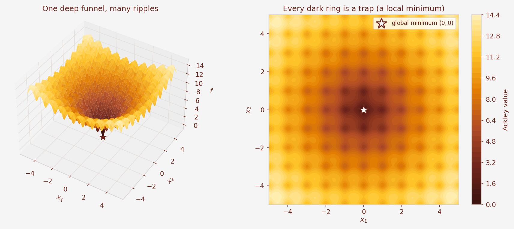
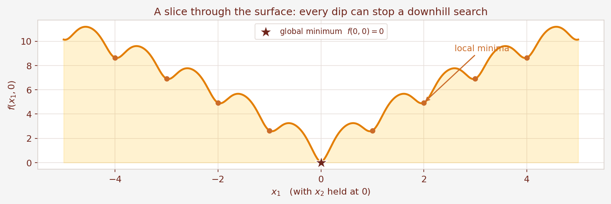
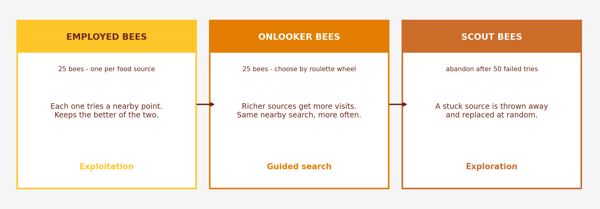
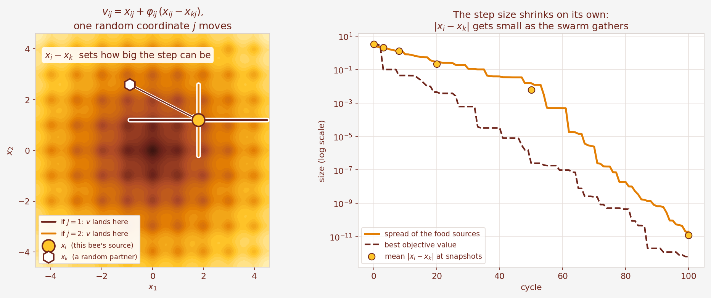
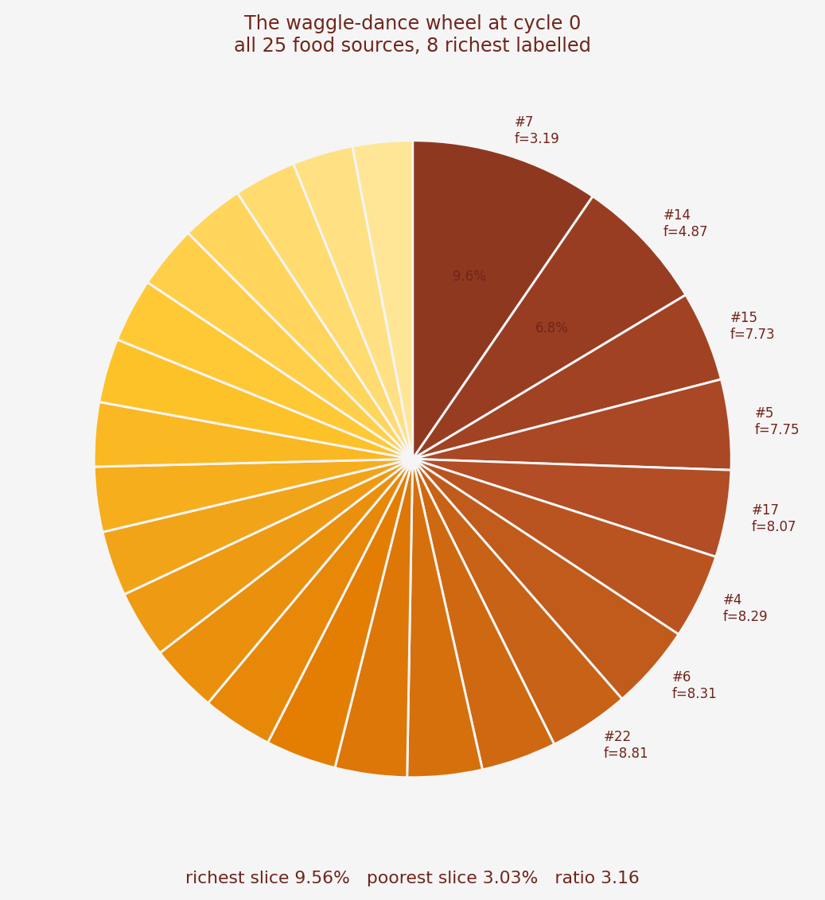
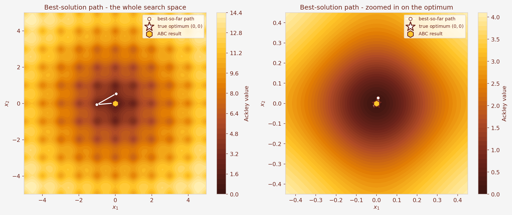
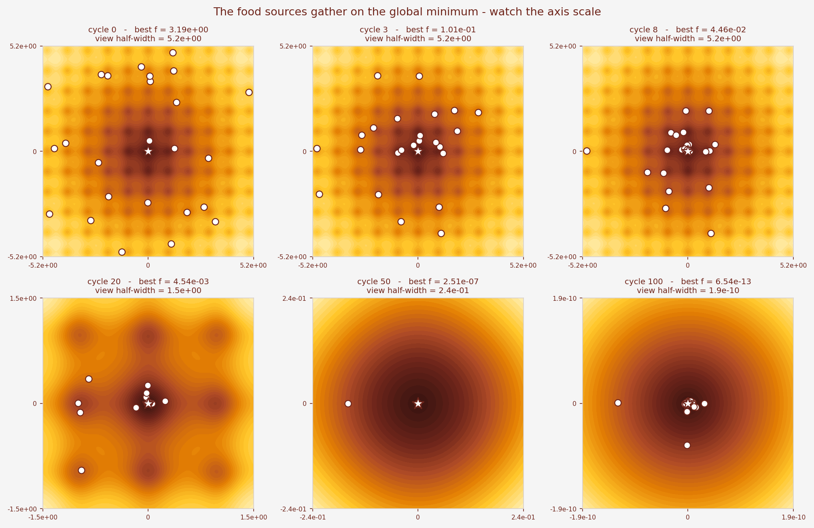
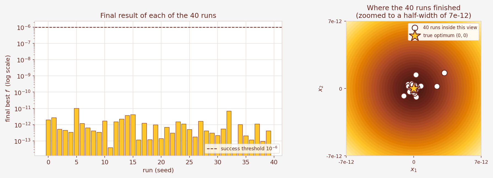
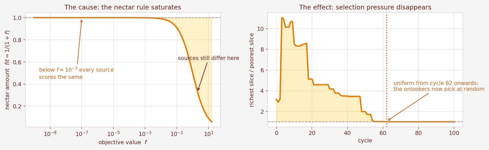

# Finding the Lowest Point of the Ackley Function — with Bees

**Course:** CSE 4111 — Machine Learning · Dept. of CSE, KUET

This folder solves the same assignment as the Genetic Algorithm project in the parent folder,
but with the **Artificial Bee Colony (ABC)** algorithm instead. Same function, same search
range, same budget, same accuracy report. Only the method changes.

Everything here follows the course slides *"7. ABC Edited"*.

---

## 1. The problem, in one picture

We have a function of two numbers, `x₁` and `x₂`. It is called the **Ackley function**.
Think of it as a landscape: for every pair of coordinates, it gives you a height.



Our job is to **find the lowest point**. Two rules:

* both coordinates must stay between **−5 and +5**;
* the program is **never told** where the lowest point is.

We happen to know the answer is at `(0, 0)`, where the height is exactly `0`. We only use that
at the end, to check how close we got.

### Why this is harder than it looks

Look at the slice below. The surface does slope towards the centre, but it is also covered in
small dips.



Each small dip is a **local minimum**: a spot that is lower than everything right next to it,
but not the lowest spot overall. Any method that simply "walks downhill" will fall into one of
them and stop. And checking every point is hopeless — a grid fine enough to be useful here
would have around 10¹⁴ points.

So we need a search that looks in many places at once and shares what it learns.

---

## 2. How honey bees solve it

Real honey bees find flowers without a map. Dervis Karaboga turned their method into an
algorithm in 2005. A **food source** is one candidate answer — just a pair of numbers
`[x₁, x₂]`. How much **nectar** it holds is how good that answer is.

There are three kinds of bee, and each has exactly one job.



| Bee | In the hive | In our program |
|---|---|---|
| **Employed** | sits on one flower patch and remembers it | each of the 25 bees tries one point near its own answer, and keeps whichever is better |
| **Onlooker** | waits in the hive, watches the waggle dance, picks a patch | 25 more tries, handed out by a **roulette wheel** so good answers get visited more |
| **Scout** | gives up on a dead patch and goes looking for new flowers | an answer that has failed 50 times in a row is thrown away and replaced at random |

The names for this are **exploitation** (employed bees: polish what you have), **guided search**
(onlookers: spend more effort where it is paying off), and **exploration** (scouts: look
somewhere completely new).

---

## 3. The whole algorithm

Straight from slide 18 of the course notes:

```
Step 1   Assign the control parameters
Step 2   Create 25 random food sources and taste them all
Step 3   Repeat until you stop:
            a. employed bee phase    - 25 nearby tries
            b. onlooker bee phase    - 25 more tries, chosen by roulette wheel
            c. memorise the best solution found so far
            d. scout bee phase       - restart any source that is stuck
Step 4   Stop and report the memorised best
```

**One detail really matters.** We memorise the best answer in step 3c, *before* the scout runs
in step 3d. If we did it the other way round, a scout could delete the best answer we had.
Memorising first is ABC's version of elitism.

---

## 4. The three equations

### Making a food source (slide 21)

```
x_ij = x_min,j + rand(0, 1) × (x_max,j − x_min,j)
```

In our case that is `−5 + rand(0,1) × 10`. The **scout phase uses this same line** to replace an
abandoned source, so we only had to write it once.

### Searching nearby (slide 23) — the heart of ABC

```
v_ij = x_ij + φ_ij × (x_ij − x_kj)
```

In plain words: *pick another bee at random, pick one of your two coordinates, and shift that
coordinate by a random fraction of the gap between you and that bee.* `φ` is a random number
between −1 and +1, so you might move towards the other bee or away from it. The other
coordinate is copied unchanged.



The right-hand panel is the clever part. The size of the step is the **gap between two bees**.
As the colony gathers around the answer, that gap gets smaller, so the steps get smaller too.
Nobody has to design a shrinking schedule — which is exactly what we *did* have to design by
hand in the Genetic Algorithm version.

Then comes **greedy selection**: keep the better of the old and the new point. If the new point
wins, the source's *trial counter* resets to 0. If it loses, the counter goes up by one. That
counter is what the scouts watch.

### Choosing which source to visit (slide 25)

Roulette selection gives bigger numbers a better chance, but for us a *smaller* value is better.
So we flip it:

```
nectar:       fit_i = 1 / (1 + f_i)          (Ackley is never negative)
probability:  P_i   = fit_i / sum of all fit
```



At the start the richest source owns about 9.6 % of the wheel and the poorest about 3.0 %. Even
a bad source keeps a real chance, which is what stops the colony committing too early.

---

## 5. The settings we used

The assignment gives a budget of 50 candidates over 100 rounds. Slide 20 says employed bees are
50 % of the colony and onlookers the other 50 %, so 50 bees means **25 food sources**.

| Parameter | Value | Why |
|---|---:|---|
| Colony size | 50 bees | matches the GA's population of 50 |
| Food sources `SN` = employed bees | 25 | 50 % of the colony (slide 20) |
| Onlooker bees | 25 | the other 50 % |
| Dimension `D` | 2 | the problem is 2-D |
| Maximum cycles | 100 | matches the GA's 100 generations |
| `limit` | 50 | the usual choice, `SN × D = 25 × 2` |
| Scouts per cycle | 1 at most | slide 20: "1 or can be more than 1" |
| Seed | 7 | so the main run repeats exactly |

ABC has **far fewer knobs than a Genetic Algorithm**. There is no crossover rate and no mutation
rate, because the single equation `v = x + φ(x − x_k)` does both jobs at once: it mixes
information from two sources *and* it adds randomness.

---

## 6. What happened

### The main run (seed 7)

| Result | Value |
|---|---|
| Best `x₁` | `+2.278 × 10⁻¹³` |
| Best `x₂` | `−3.938 × 10⁻¹⁴` |
| Best `f(x₁, x₂)` | `6.541 × 10⁻¹³` |
| Distance to `(0, 0)` | `2.312 × 10⁻¹³` |
| Found at | cycle 99 of 100 |
| Ackley evaluations | 5,025 (budget 5,125) |
| Scouts needed | 0 |



The left picture shows the best answer wandering across the whole square early on; the right
picture zooms in and shows it making smaller and smaller corrections near the end.



**Read the axis numbers on this one.** Each panel is zoomed in much further than the panel
before it. By cycle 100 the whole picture is only about `2 × 10⁻¹⁰` wide.

### Is it reliable, or did we get lucky?

One good run proves almost nothing, so we ran 40, changing nothing but the random seed.



* **40 / 40** runs finished below our target of `10⁻⁶`
* median `5.476 × 10⁻¹³`, worst `1.034 × 10⁻¹¹`, best `2.887 × 10⁻¹⁴`
* pure random search with the same 5,025 evaluations only reached `0.769`

---

## 7. The interesting part: which bits actually matter?

This is the experiment we are most pleased with. Each row changes **one thing** and runs the
same 40 seeds.

| What we changed | median `f` | worst `f` | reached `10⁻⁶` | scouts sent |
|---|---|---|---|---|
| **full ABC as taught** | **5.476e-13** | **1.034e-11** | **40 / 40** | 0 |
| no onlooker phase | 2.999e-07 | 4.262e-06 | 36 / 40 | 0 |
| no scout phase | 5.476e-13 | 1.034e-11 | 40 / 40 | 0 |
| perturb both coordinates | 2.509e-13 | 4.267e-12 | 40 / 40 | 0 |
| `limit` = 10 | 2.256e-06 | 1.071e-04 | 16 / 40 | 1,562 |
| `limit` = 5 | 5.358e-04 | 1.248e-02 | 0 / 40 | 2,107 |
| colony 10 (5 sources) | 2.647e-04 | 4.121e-01 | 11 / 40 | 260 |

Three honest conclusions, and one of them surprised us.

**1. The onlooker phase is what makes the answer precise.** Remove it and the median gets about
500,000 times worse, and four runs miss the target. The extra 25 tries per cycle, aimed at the
better sources, are doing the real work.

**2. The `limit` is the dangerous knob.** Set it to 5 and the colony panics: it sends over 2,000
scouts, throws away good sources faster than it can refine them, and **not one run** reaches the
target. The textbook value `SN × D = 50` is fine.

**3. The scout phase never fired at all.** Turning it off changes absolutely nothing. On this
problem the bees always find *some* improvement before any counter reaches 50 — the largest
counter in the whole main run was 23. The scout phase is insurance, not the engine.

That last one is worth saying out loud: on every ABC flowchart the scout phase looks essential,
and on this problem it never ran once. We would expect it to matter on a harder or
higher-dimensional function — but we did not test that, so we are not going to claim it.

### A wrinkle we found in the nectar rule

`fit = 1/(1+f)` can never be bigger than 1. So once every source has `f` below about `10⁻³`,
*every* nectar value rounds to 1, every slice of the wheel becomes exactly `1/25 = 4.00 %`, and
the onlookers are choosing completely at random.



In our main run that happens at **cycle 62**. It sounds like a serious bug, so we measured it
rather than guessing, and also tried two published alternatives that keep the wheel sharp. The
medians came out at 5.5, 6.0 and 24.3 `× 10⁻¹³` — no meaningful difference. The reason is simple:
by cycle 62 all 25 sources are already inside the correct valley, so picking one at random is
nearly as good as picking the best.

---

## 8. Bees next to genes

We solved the same problem twice, on the same 40 seeds, with practically the same budget — so
this comparison is fair.

| | Genetic Algorithm | Artificial Bee Colony |
|---|---|---|
| Ackley evaluations | 5,050 | 5,025 |
| Best of 40 runs | 1.106e-13 | 2.887e-14 |
| **Median of 40 runs** | 1.636e-12 | **5.476e-13** |
| Worst of 40 runs | 3.137e-11 | 1.034e-11 |
| Runs below `10⁻⁶` | 40 / 40 | 40 / 40 |
| Parameters we had to choose | 5 | 1 |

Both methods are reliable. ABC landed about three times closer to zero using slightly
fewer evaluations — a small difference. The clearer difference is the last row. For the Genetic
Algorithm we had to pick a crossover rate, a mutation rate, a mutation-step rule, an elitism
count and a duplicate cap. For ABC we picked one number, the `limit`, and the step size took
care of itself.

That is what the course slides mean by ABC's advantage: *"few control parameters"*.

**But be careful with this:** it is one function, in two dimensions, at one budget, over 40
seeds. It is evidence, not proof that ABC is the better algorithm in general.

---

## 9. What is in this folder

| File | What it is |
|---|---|
| `README.md` | this file — the plain-language guide |
| `EXPLANATION.md` | **start here if you are new**: ABC from zero, then Ackley, then every step, every figure, and how we checked our own work |
| `Ackley_ABC_Assignment_Notes.md` | the assignment restated for ABC, with the equations and the GA→ABC mapping |
| `Ackley_ABC_Solution.ipynb` | the notebook: 30 short sections, every cell already run with its output saved |
| `Ackley_ABC_Presentation.pptx` | the 19-slide deck (also as `.pdf`) |
| `Ackley_ABC_Presentation_Script.md` | what to say on each slide, plus answers to likely teacher questions |
| `figures/` | every picture used above, regenerated by one script |
| `build/` | the scripts that produce all of the above |
| `review/` | rendered slide images, contact sheets, the layout check, and `results.json` |

### Running it yourself

```bash
cd build
python abc_core.py          # one ABC run, prints the result
python make_figures.py      # regenerate every figure in figures/
python make_notebook.py     # rebuild the notebook from source

cd ../review
python experiments.py       # re-run all 40-seed studies, writes results.json
```

`build/abc_core.py` is the reference implementation. The notebook re-creates the same functions
step by step so you can read them in order; both give identical numbers.

To rebuild the deck you also need PowerPoint (the build uses it to add the click reveals and
export the PDF):

```bash
cd build
python build_deck.py        # writes the .pptx and the speaking script
python render_and_check.py  # adds animations, exports PNG + PDF, checks for overflowing text
```

### Where the numbers come from

Every figure quoted in this README and on the slides is produced by `review/experiments.py`,
which writes `review/results.json`. The notebook reproduces the same values independently. The
main run uses seed 7 and is exactly repeatable.

Two things to be precise about if you are asked:

* **5,025** is the number of Ackley calls that actually happened: 25 at the start, then
  100 cycles x (25 employed + 25 onlooker), and no scout ever flew. **5,125** is the worst-case
  budget, which assumes a scout flies every cycle. The code reports both, as `evaluations` and
  `evaluation_budget`.
* **"Success" means `f < 10⁻⁶`** and **"correct valley" means the distance to `(0,0)` is below
  0.5**. Neither means the answer is exactly zero. Floating-point numbers have limited
  precision, so quote the measured errors rather than claiming unlimited decimals.
